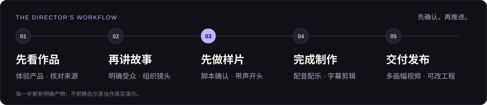

<a name="top"></a>

<p align="center">
  <picture>
    <source media="(max-width: 600px)" srcset="docs/media/readme/hero-mobile.svg">
    
  </picture>
</p>

<h1 align="center">VibeCoding 作品宣传 Skill</h1>

<p align="center">把你做出来的网站、App、工具和小游戏，讲给真正需要它的人。</p>

<p align="center">
  <a href="https://github.com/lhfer/meoo-vibecoding-video/releases/latest/download/vibecoding-launch-video.zip"><strong>下载 Skill ZIP ↗</strong></a>
  &nbsp; · &nbsp;
  <a href="https://meoo.com/skills"><strong>在秒悟使用 ↗</strong></a>
  &nbsp; · &nbsp;
  <a href="docs/getting-started.md"><strong>安装指南</strong></a>
</p>

<p align="center">
  <a href="https://github.com/lhfer/meoo-vibecoding-video/releases/latest">v2.0.1</a>
  &nbsp; / &nbsp; <a href="LICENSE">MIT · 代码与文档</a>
  &nbsp; / &nbsp; Meoo · Claude Code · Cursor · Codex
</p>

<p align="center">
  <a href="#workflow">制作流程</a> &nbsp; · &nbsp;
  <a href="#case-study">案例与方法</a> &nbsp; · &nbsp;
  <a href="#start">开始使用</a> &nbsp; · &nbsp;
  <a href="#boundaries">使用边界</a>
</p>

---

你已经把作品做出来了。接下来，不是再堆一页功能介绍，而是让观众看见：**它解决什么问题，为什么值得试。**

这是 **{一起 Vibe} × 秒悟 Meoo** 共创的开源工作流。它把素材核对、脚本、镜头、配音、剪辑和多画幅交付连接起来。你决定方向、确认关键样片，也可以修改每一步。

<a name="workflow"></a>

## 01 / 从真实作品，到完整视频

<p>
<picture>
  <source media="(max-width: 600px)" srcset="docs/media/readme/workflow-mobile.svg">
  
</picture>
</p>

| 从你这里开始 | 一起完成并交付 |
| :--- | :--- |
| 产品链接、真实操作录屏、已有素材 | 核对核心用途，整理素材与来源 |
| 目标受众、想讲的重点、发布平台 | 完整脚本、镜头安排、带声开头样片 |
| 对脚本和样片的反馈 | 按需求输出视频、封面与可修改工程 |

**真实内容优先。** 不把生成画面、伪 UI 或静帧动画冒充产品实测。支持按需求制作 **3:4、9:16、16:9**；不同画幅分别构图，不只是把画面裁一刀。

<a name="case-study"></a>

## 02 / 看看一条视频背后的方法

<p>
<a href="docs/case-study.md">
  <picture>
    <source media="(max-width: 600px)" srcset="docs/media/readme/case-cover-mobile.svg">
    
  </picture>
</a>
</p>

**先组织，再剪辑。** 按主题安排观看顺序，让每句讲解都有对应画面，再用代表性结果给观众一个继续看的理由。

[阅读完整复盘与真实预览 →](docs/case-study.md) · [直接打开成片节选](docs/media/case-preview.gif)

<sub>这是 {一起 Vibe} 的历史制作经验，也是共创 Skill 的方法来源；不是本 Skill 或秒悟端到端生成效果的证明。预览保留原作者标识。顶部画框与时间线仅为流程示意。</sub>

<a name="start"></a>

## 03 / 选一个入口，开始第一条

### 在秒悟里，直接开始

打开 [秒悟](https://meoo.com/) → 首页左侧 **技能** → 搜索 **爆款短视频** → 选择 **一键 VibeCoding 作品转爆款短视频**。

添加后，把作品素材和目标交给它。平台条目与仓库版本分别维护；需要精确使用本仓库版本时，下载独立 ZIP 并按 [秒悟技能说明](https://docs.meoo.com/file) 导入。

### 在自己的 AI 编程工具里使用

[下载独立 ZIP](https://github.com/lhfer/meoo-vibecoding-video/releases/latest/download/vibecoding-launch-video.zip)，解压并进入 `vibecoding-launch-video/` 文件夹，先检查环境，再安装到需要的宿主：

```bash
python3 scripts/doctor.py
python3 scripts/install.py --hosts claude,cursor,codex --dry-run
python3 scripts/install.py --hosts claude,cursor,codex
```

`--hosts` 只填写你需要的宿主。已有安装不会被覆盖；项目级安装和媒体能力配置见 [安装与配置](docs/getting-started.md)。

### 复制这段，交给 Agent

```text
使用 $vibecoding-launch-video 2.0.1。

帮我给这个作品做一条面向潜在用户的宣传视频。
产品链接 / 素材：〔填这里〕
目标受众：〔填这里〕
发布平台与画幅：〔填这里〕

先体验产品并核对真实素材，讲清谁需要它、怎么使用。
先给我完整脚本和带声音的开头样片，确认后再继续全片。
素材或工具能力有缺口时，请说明，不要用伪 UI 冒充实测。
```

<a name="boundaries"></a>

## 04 / 好看之外，也要可靠

**Skill 提供制作方法和工程，不附带模型服务额度，也不承诺一键生成爆款。** 工具、联网和生成能力以当前宿主与实际配置为准。

<details>
<summary><strong>运行环境与模型配置</strong></summary>

本地执行需要支持文件与命令工具的 Agent、Node.js 22+、Python 3.10+、FFmpeg / ffprobe，以及可用 Chromium。具体缺项以 `doctor.py` 输出为准。

Agent 模型在宿主里选择。生图、配音、音乐等媒体能力使用宿主已有工具或你配置的服务；无需为了试用同时配置所有提供者。凭据只保存在本地，不写进仓库和附件。

[查看完整安装与配置](docs/getting-started.md)

</details>

<details>
<summary><strong>验证范围与人工确认</strong></summary>

先确认完整脚本与实际带声样片，再进入全片。信息是否准确、画面是否好看、声音是否合适，仍需实际审阅。

历史案例不是本版本运行证明；Meoo 新版在线端到端生成尚未验证。发布检查与限制以 [当前验证记录](docs/release-verification.md) 为准。遇到权限、网络或生成额度问题时，应保留工程和错误信息，不伪造成功。

</details>

<details>
<summary><strong>代码、品牌与素材许可</strong></summary>

原创代码与文档采用 [MIT](LICENSE)。头像、Meoo 标识、吉祥物、横幅和案例媒体不按 MIT 再授权，详见 [视觉与案例素材说明](BRAND_ASSETS.md)。

Remotion 等依赖沿用各自许可证，参见 [第三方说明](THIRD_PARTY_NOTICES.md)。制作自己的视频时，使用有权使用的字体与素材，并保留来源；共创身份不是强制加在你视频上的水印。

</details>

## 05 / 文档与共创

| 想做什么 | 从这里继续 |
| :--- | :--- |
| 安装、配置或排查环境 | [快速开始](docs/getting-started.md) · [秒悟使用指南](MEOO-QUICKSTART.md) |
| 理解规则与发布状态 | [Skill 入口](SKILL.md) · [版本记录](CHANGELOG.md) · [验证范围](docs/release-verification.md) |
| 把文章或资讯做成短视频 | [另一套独立技能：内容转短视频](https://github.com/lhfer/meoo-article-to-video) |
| 反馈问题或参与改进 | [提交 Issue](https://github.com/lhfer/meoo-vibecoding-video/issues) · [README 视觉维护](docs/readme-design.md) |

<details>
<summary><strong>开发者检查命令</strong></summary>

```bash
python3 scripts/check-readme.py
python3 -m unittest discover -s tests -p 'test_*.py'
node --test tests/*.test.mjs
cd assets/director
npm ci
npm run check
```

反馈问题时，附技能版本、宿主、预期结果与脱敏后的错误信息。不要上传 API Key、Cookie 或其他凭据。

</details>

---

<p align="center"><strong>好作品，值得被看见。</strong></p>
<p align="center">{一起 Vibe} × 秒悟 Meoo</p>
<p align="center">
  <a href="https://meoo.com/">秒悟</a> &nbsp; · &nbsp;
  <a href="https://github.com/lhfer/meoo-article-to-video">配套技能</a> &nbsp; · &nbsp;
  <a href="#top">回到顶部 ↑</a>
</p>
