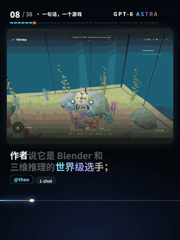

[← 返回项目首页](../README.md)

# GPT-6「38 个案例」：历史流程复盘

<picture>
  <source media="(max-width: 600px)" srcset="media/brand-v2/case-mobile.png">
  
</picture>

示例来自 **{一起 Vibe}** 的 GPT-6 Astra 网友案例合集。历史成片约 **5 分 34 秒**，包含 38 个社区案例与独立标注的官方演示。这里展示的是素材组织与镜头叙事的方法，**不作为本 Skill 或秒悟端到端生成的证明**。

## 先看真实成片节选

[直接打开预览文件](media/case-preview.gif)

共创发布记录保存了输入文件和实际成片的本地校验。公开仓库只展示短预览，并保留画面原作者标识；不分发全套第三方原素材。

## 01 / 先组织观看顺序

原片按游戏、风格、三维世界、创作、电脑操作和长任务展开。先把材料分成观众能理解的主题，再安排镜头，不按收集先后简单拼接。

## 02 / 让讲解有画面依据

解说里的动作，要在画面中看得到。引述他人测试时保留来源，区分作者自述与自己实测。漂亮但无关的画面，不能代替证据。

## 03 / 给出继续看的理由

开头先展示代表性结果，再交代“38 个案例一次看完”的观看价值，让观众尽早知道这条视频能带来什么。

---

这套经验先用于历史作品，再整理为共创 Skill。安装后仍需要你自己的输入材料、运行环境和实际审阅。

[开始使用](getting-started.md) · [当前验证范围](release-verification.md) · [素材许可](../BRAND_ASSETS.md)
